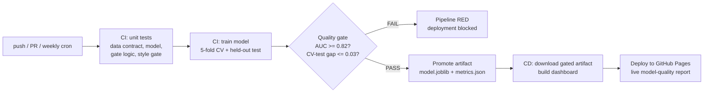

# EvalGate - a CI/CD Pipeline That Blocks Bad Models

**Every push automatically tests the code, retrains the model, enforces a hard quality gate (a weak model turns the pipeline red and never ships), promotes the trained artifact, and deploys a live model-quality dashboard. The pipeline is the product.**

[](https://github.com/PSPMANI/evalgate/actions/workflows/ci.yml)
[](https://github.com/PSPMANI/evalgate/actions/workflows/cd.yml)
[](https://pspmani.github.io/evalgate/)


**Live dashboard (published by the CD pipeline itself):** https://pspmani.github.io/evalgate/

---

## The pipeline



Two separate workflows, chained the way real teams chain them:

| Stage | Workflow | What happens |
|---|---|---|
| CI | `ci.yml` | 11 pytest checks (data schema, leakage guard, model determinism, unseen-category robustness, gate logic, ASCII style gate), then trains a churn model (7,032 customers, Gradient Boosting) and runs `gate.py` |
| Quality gate | `gate.py` | Hard thresholds: test ROC-AUC >= 0.82, accuracy >= 0.75, CV AUC >= 0.82, and CV-vs-test gap <= 0.03 (a drift/leakage smell check). Below any bar: exit 1, pipeline red, nothing ships |
| Artifact promotion | `ci.yml` -> `cd.yml` | The trained `model.joblib` + `metrics.json` are uploaded as a build artifact; CD downloads exactly that gated artifact - it never retrains, it ships what was approved |
| CD | `cd.yml` | Triggered by `workflow_run` only when CI succeeded on main; builds the dashboard from the promoted metrics and deploys to GitHub Pages through a deployment environment |

Also wired in: a **weekly scheduled retrain** (cron) so the pipeline re-validates the model even with no code changes, `workflow_dispatch` for manual runs, pip caching, and `concurrency` control on deployments.

## Why a quality gate

A test suite proves the code works. It says nothing about whether the **model** is good.
EvalGate treats model quality like any other CI check: measurable, thresholded, and
blocking. If a data change or refactor silently degrades ROC-AUC below 0.82, the
pipeline goes red and the bad model never reaches production. This is the same
discipline as my evaluation work (rubrics and verifiers that gate AI outputs) applied
to the deployment pipeline itself.

## The dashboard is stateless-with-history

The CD job fetches the currently published `history.json` from the live site, appends
the new gated run, and republishes - so the site itself stores the deployment history
(commit, date, AUC trend chart) with no database and no server.

## Run it locally

```
pip install -r requirements.txt
pytest -q            # the CI checks
python train.py      # train + write metrics.json
python gate.py       # enforce the quality gate (exit 1 = blocked)
python build_report.py   # build the dashboard into site/
```

## Repo layout

```
train.py                 model training (deterministic, writes metrics.json)
gate.py                  the quality gate CI enforces
build_report.py          dashboard builder CD publishes
tests/                   11 checks: data contract, model, gate logic, style
.github/workflows/ci.yml CI: tests -> train -> gate -> artifact
.github/workflows/cd.yml CD: workflow_run -> download artifact -> Pages deploy
data/telco_churn.csv     IBM Telco churn dataset (public)
```

## What this demonstrates

- GitHub Actions: multi-job workflows, `needs` chains, `workflow_run` triggers,
  scheduled crons, manual dispatch, pip caching, artifact promotion between
  workflows, deployment environments, Pages deployments, concurrency control.
- MLOps: automated retraining, metric thresholds as deployment gates,
  reproducible seeds, drift-smell checks (CV-vs-test gap), model artifact lifecycle.
- Testing: data contracts, leakage guards, determinism tests, robustness to unseen
  categories, and testing the gate itself.
