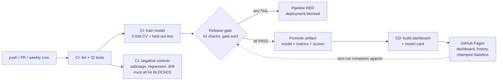

# EvalGate - a CI/CD Release Gate That Blocks Bad Models

**Every push tests the code, retrains the model and runs a 42-check release gate: quality floors, calibration, every customer segment, fairness gaps, non-inferiority to the model already in production, and feature drift. Any failure turns the pipeline red and nothing ships. CI also proves the gate says no: a sabotaged model, a subtle regression that clears the AUC floor, and a drifted data batch are all built and must all be blocked.**

[](https://github.com/PSPMANI/evalgate/actions/workflows/ci.yml)
[](https://github.com/PSPMANI/evalgate/actions/workflows/cd.yml)
[](https://pspmani.github.io/evalgate/)
[](https://pspmani.github.io/evalgate/model_card.md)


**Live dashboard (published by the CD pipeline itself):** https://pspmani.github.io/evalgate/

---

## The pipeline



| Stage | Where | What happens |
|---|---|---|
| Tests | `ci.yml` | ruff, then 32 pytest checks: every gate metric on hand-computable inputs, every policy rule, two real-data release scenarios, data contract, determinism, ASCII style gate |
| Train | `train.py` | Gradient Boosting churn model on 7,032 customers; writes metrics, held-out scores and a feature profile |
| Release gate | `gate.py` + `gate.toml` | 42 checks (below). Any failure: exit 1, pipeline red, nothing ships |
| Negative controls | `ci.yml` | Builds three things that must be rejected and fails the workflow if any gets through |
| Promote | `ci.yml` -> `cd.yml` | The gated artifact is uploaded; CD downloads exactly that artifact. It never retrains, it ships what was approved |
| Deploy | `cd.yml` + `build_report.py` | Dashboard, model card, run history and the new champion baseline, published to GitHub Pages |

Also wired in: a weekly scheduled retrain, `workflow_dispatch`, pip caching, `concurrency`
on deployments, and a job summary that renders the full gate table on every run.

## The release gate

The policy lives in [`gate.toml`](gate.toml), so changing a threshold is a reviewed diff,
not an edit buried in code.

| Group | Checks | Why |
|---|---|---|
| Quality | test ROC-AUC >= 0.82, accuracy >= 0.75, CV ROC-AUC >= 0.82 | the absolute floor |
| Leakage smell | CV vs test AUC gap <= 0.03 | CV and held-out disagreeing means a broken split or overfitting |
| Calibration | ECE <= 0.05, Brier <= 0.16 | a retention team acts on the probabilities, not just the ranking |
| Segments | AUC >= 0.65 in every slice of gender, SeniorCitizen, Contract, tenure band and InternetService with n >= 100 | a good average can hide a segment where the model fails |
| Fairness | AUC gap <= 0.08 across gender and across SeniorCitizen | the model should rank churn risk about as well for every group |
| Champion | lower 95% bound of (new - deployed) AUC >= -0.01, paired bootstrap on the same customers | a new model may not be measurably worse than the one in production |
| Drift | PSI <= 0.25 for every feature, held-out vs training | the evaluation data must look like the training data |

### Why the champion check matters: a regression v1 would have shipped

The CI regression demo trains a smaller booster (20 trees, depth 2). It scores **ROC-AUC
0.828, above the 0.82 floor**, so an absolute-threshold gate (all EvalGate v1 had) passes it.
Compared with the deployed model on the same 1,407 customers it is **-0.010 AUC, 95% CI
[-0.018, -0.002]**, so v2 blocks it. The comparison is paired, so test-set luck cancels
out and only the difference between the models remains. The champion's held-out scores are
published to the Pages site on every deploy, and the next run compares against them. The
comparison needs no database and no server.

### Drift monitoring

`train.py` saves a profile of every feature's training distribution. `monitor.py` scores a
new batch against it with the population stability index (below 0.10 stable, 0.10 to 0.25
moderate, above 0.25 blocks):

```text
$ python monitor.py --make-shifted-demo shifted.csv   # price +25%, 60% of term contracts go monthly
$ python monitor.py shifted.csv
[FAIL] PSI MonthlyCharges       1.1138
[FAIL] PSI Contract             0.3635
[  ok] PSI tenure               0.0004
...
DRIFT BLOCKED: PSI MonthlyCharges, PSI Contract shifted significantly; retrain or investigate.
```

On the training data itself every feature scores below 0.02. CI runs both directions.

## Current model

| Metric | Value |
|---|---|
| Test ROC-AUC | 0.839 (95% bootstrap CI 0.816 to 0.859) |
| 5-fold CV ROC-AUC | 0.847 +/- 0.003 |
| Calibration | ECE 0.026, Brier 0.139 |
| Weakest gated segment | Contract = One year, AUC 0.70 (n = 290) |
| Fairness gaps | gender 0.014, SeniorCitizen 0.059 |

Segment AUCs within a contract type are lower than the overall AUC because contract type is
itself the strongest churn signal; within one type the model has less to separate on. The
[model card](https://pspmani.github.io/evalgate/model_card.md) published with each deploy has
the full table.

## The dashboard

The CD job fetches the currently published `history.json` from the live site, appends the new
gated run and republishes, so the site itself stores the deployment history with no database.
It shows the full gate table, a calibration plot, AUC across deployments against the gate
floor, and links the model card.

## Run it locally

```bash
pip install -r requirements.txt
pytest -q                              # the CI tests
python train.py                        # train, write metrics / scores / profile
python gate.py --champion none         # enforce the release gate (exit 1 = blocked)
python build_report.py                 # dashboard + model card into site/
python train.py --sabotage && python gate.py --champion none      # watch it get blocked
python monitor.py --make-shifted-demo shifted.csv && python monitor.py shifted.csv
```

## Repo layout

```
gate.toml                release policy: every threshold that can block a deploy
train.py                 training (deterministic); --sabotage and weaker-model demo flags
gate.py                  the release gate CI enforces; writes gate_report.json and a job summary
monitor.py               PSI drift monitor for new batches
build_report.py          dashboard, model card, history and champion baseline for Pages
evalgate/metrics.py      ECE, bootstrap AUC CI, paired AUC difference, slices, PSI
evalgate/checks.py       the policy as pure, unit-tested functions
tests/                   32 tests
.github/workflows/       ci.yml (tests, train, gate, negative controls), cd.yml (Pages deploy)
data/telco_churn.csv     IBM Telco churn dataset (public)
```

## Limitations

- The dataset is public and static, so the weekly retrain re-validates the pipeline rather
  than learning from new customers, and drift is demonstrated on a constructed batch.
- Segment AUCs on small groups (senior citizens, n = 232) are noisy. Slices under 100
  customers are reported but not gated.
- Fairness checks cover only the attributes in the data (gender, SeniorCitizen), and equal
  AUC is one fairness criterion among several.
- Held-out AUC differs by 0.0001 between Windows and Linux builds (floating-point order);
  CI, which produces every deployed number, runs on Linux only.

## What this demonstrates

- MLOps: metric thresholds, calibration, segment and fairness checks, champion/challenger
  non-inferiority and drift monitoring as deployment gates, with the policy in config.
- Evaluation rigor: bootstrap confidence intervals, a paired test for model comparison, and
  negative controls that prove the gate rejects what it should.
- GitHub Actions: multi-job workflows, `needs` chains, `workflow_run` triggers, scheduled
  crons, artifact promotion between workflows, Pages deployments, job summaries.
- Testing: the gate itself is unit-tested, plus data contracts, determinism, robustness to
  unseen categories, and a style gate.
